# 花卷 · 一款支持本地部署的 AI 一站式调用平台

## 项目介绍

### 总览

花卷(HuaJuan)是一款Android平台上的AI助手应用，支持云端与本地模型部署，旨在为用户提供一站式的AI模型调用、存储与分享体验。应用还提供角色扮演社区与AI创作分享社区，以提升用户体验、鼓励用户交流。应用仿效豆包进行设计。

### 模型调用

在云端，应用支持多种AI服务提供商，向用户提供大量预设模型，如Qwen系列、DeepSeek系列、GPT系列、Claude系列、Gemini系列等。应用同时提供了自带的API密钥，方便用户初步体验。
应用还允许用户进行自定义服务商和模型配置。

在本地，应用打包了两款小参数的AI模型，Qwen3-0.6B-MNN与MobileLLM-125M-MNN，对中文与英文都具有良好的适配，使得注重隐私的用户也能有良好的体验。

### 聊天功能

- 实时流式对话交互，支持逐字输出效果
- Markdown格式消息渲染，支持代码高亮，$\LaTeX$显示
- 对话历史记录管理，包括保存、编辑、置顶、删除等功能

### 社区分享页面

应用有专设的"AI创作分享"页面，实现了从文本到多媒体（网页、图片等）的自动转换，便于用户社区进行分享。

同时应用也支持整则对话分享功能，支持把元数据JSON整理导出为美观的HTML，优化分享体验。

### 角色扮演功能

应用有专设的"AI智能体"页面，允许用户选择预设角色与自定义角色，支持为每则对话设置独立的角色名称和系统提示词。

### 界面、交互与设置

应用使用了 Material Design 3 设计风格，支持深色/浅色主题切换。应用实现了与豆包相近的手势操作、侧滑菜单等。动画美观流畅，设计高级自然，用户体验舒适。
同时具有响应式布局，以适配不同屏幕尺寸。

## 项目展示

| 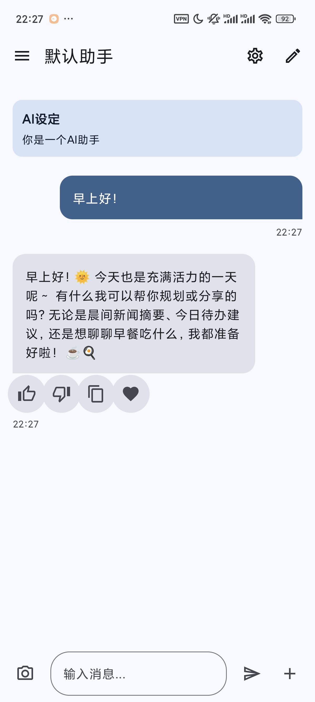 | 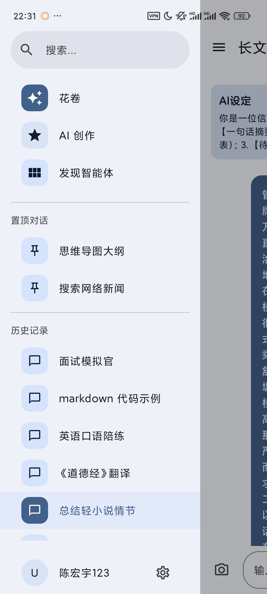 | 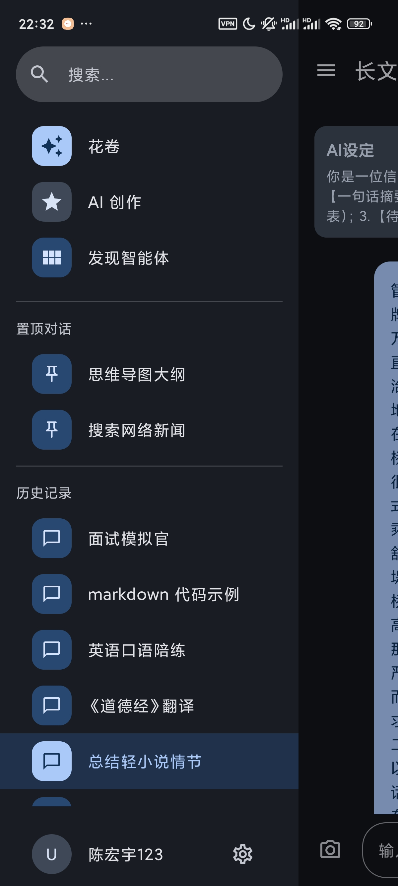 |
| --- | --- | --- |
| 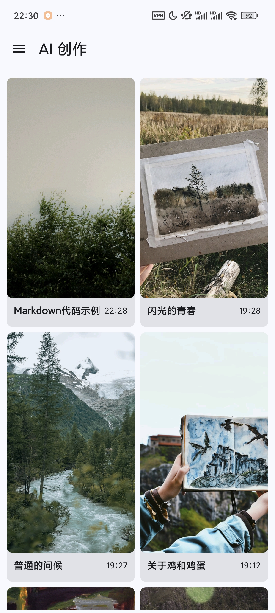 | 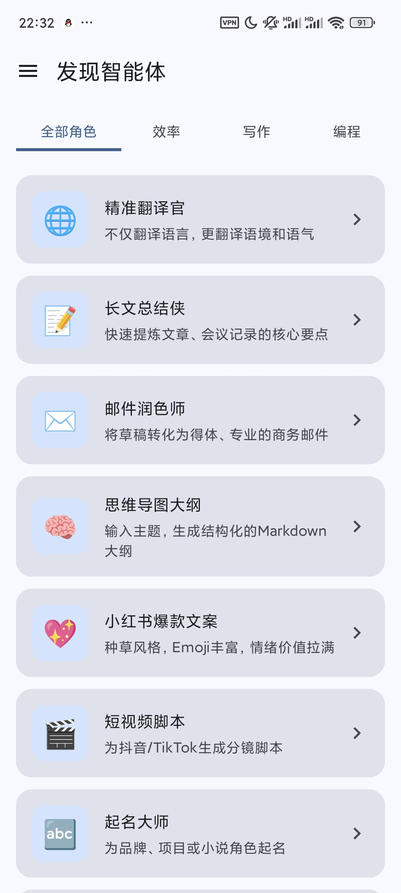 | 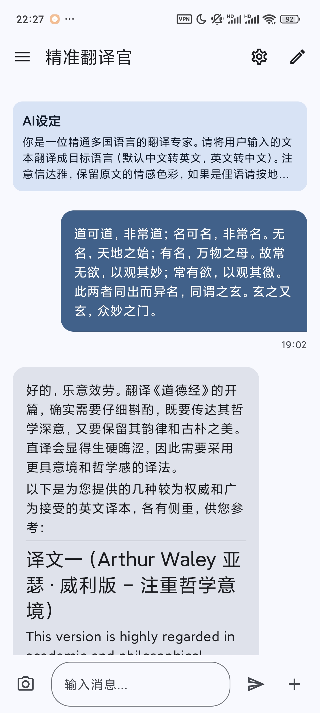 |
| 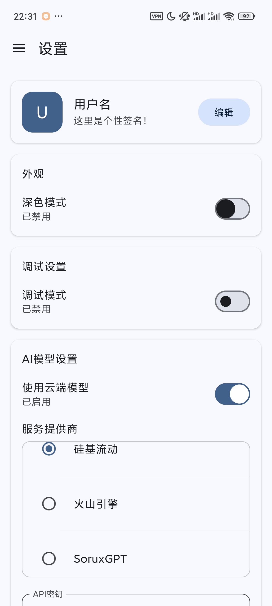 | 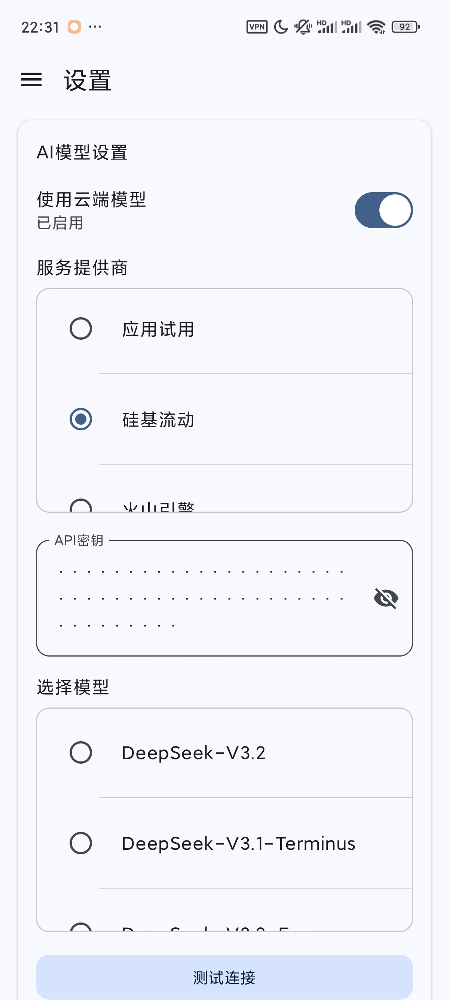 | 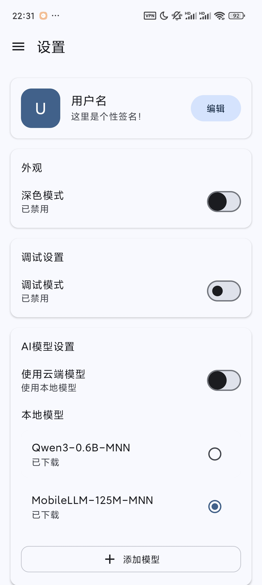 |

## 实现方式

### 云端模型调用

应用通过Retrofit和OkHttp网络库实现与各大AI服务提供商的API通信。项目采用了工厂模式和策略模式，通过[ModelApiFactory](https://github.com/Enchograph/HuaJuan/app/src/main/java/com/chenhongyu/huajuan/data/ModelApiFactory.kt)创建对应的[ModelApiService](https://github.com/Enchograph/HuaJuan/app/src/main/java/com/chenhongyu/huajuan/data/ModelApiService.kt)实例，根据用户设置决定使用在线模型([OnlineModelApiService](https://github.com/Enchograph/HuaJuan/app/src/main/java/com/chenhongyu/huajuan/data/OnlineModelApiService.kt))还是本地模型([LocalModelApiService](https://github.com/Enchograph/HuaJuan/app/src/main/java/com/chenhongyu/huajuan/data/LocalModelApiService.kt))。

对于在线模型调用，应用构造符合各类厂商格式要求的API请求，支持包括但不限于OpenAI、Anthropic、硅基流动等服务提供商。通过OkHttp的流式处理能力，应用能够接收服务端的SSE(Streaming Server Events)响应，实现实时逐字输出效果。

应用内部使用[ModelDataProvider](https://github.com/Enchograph/HuaJuan/app/src/main/java/com/chenhongyu/huajuan/data/ModelData.kt)管理预定义的服务提供商和模型信息。预定义的服务提供商包括：

1. 硅基流动：提供DeepSeek、Qwen等多个模型
2. 火山引擎：提供Doubao、Kimi等多个模型
3. SoruxGPT：提供ChatGPT、Claude、DeepSeek、Gemini等多个模型
4. OpenAI：提供GPT系列模型
5. Anthropic：提供Claude系列模型
6. Google：提供Gemini系列模型

对于每个服务提供商，系统维护其API地址和模型列表。例如，硅基流动的服务地址为"<https://api.siliconflow.cn/v1/chat/completions/"，提供包括DeepSeek-V3.2、Qwen3-VL等多个模型。>

网络请求通过[createOkHttpClient](https://github.com/Enchograph/HuaJuan/app/src/main/java/com/chenhongyu/huajuan/data/OnlineModelApiService.kt)方法创建OkHttpClient实例，设置了30秒连接超时和无限读取超时（支持流式响应）。通过HttpLoggingInterceptor记录请求头信息用于调试。

应用通过[streamAIResponse](https://github.com/Enchograph/HuaJuan/app/src/main/java/com/chenhongyu/huajuan/data/OnlineModelApiService.kt)方法实现流式响应处理。该方法使用channelFlow构建Flow，通过OkHttp的ResponseBody获取BufferedReader，逐行读取服务端响应。对于以"data:"开头的数据行，去除前缀后解析JSON内容，提取其中的文本内容作为ChatEvent.Chunk事件发送；遇到"[DONE]"标识时发送Done事件结束流。

### 本地模型调用

应用集成了Qwen3-0.6B-MNN等轻量级模型，打包在APK的assets/model目录中。本地模型通过MNN-LLM框架进行推理，保证了在移动设备上的运行效率。

本地模型调用通过[LocalModelApiService](https://github.com/Enchograph/HuaJuan/app/src/main/java/com/chenhongyu/huajuan/data/LocalModelApiService.kt)实现，该类继承自ModelApiService接口。

[getAIResponse](https://github.com/Enchograph/HuaJuan/app/src/main/java/com/chenhongyu/huajuan/data/LocalModelApiService.kt)方法实现本地模型的实际调用逻辑。该方法首先加载位于assets/model目录下的模型文件，通过MNN推理框架加载模型并初始化推理环境。然后将用户输入文本进行分词处理，转换为模型可接受的Tensor格式，执行推理操作获得输出结果，最后将输出结果解码为可读文本。

本地模型支持量化版本以减小模型体积并提高推理速度，包括INT8和INT4量化方式。模型推理过程中使用CPU进行计算，通过多线程优化提高推理效率。

### 聊天渲染

#### 流式输出

应用通过Kotlin Coroutines和Jetpack Compose的状态管理机制实现了真正的流式输出效果。在[ChatScreen](https://github.com/Enchograph/HuaJuan/app/src/main/java/com/chenhongyu/huajuan/ChatScreen.kt)中，当用户发送消息后，系统会创建一个空的AI回复消息并立即显示在界面上。

随后调用[repository.streamAIResponse](https://github.com/Enchograph/HuaJuan/app/src/main/java/com/chenhongyu/huajuan/data/Repository.kt)方法获取AI响应流，通过collectLatest收集Flow中的事件。对于每个ChatEvent.Chunk事件，系统会将新文本追加到当前AI消息中并更新UI。

自动滚动功能通过LazyColumn的state实现。系统检测用户是否在底部附近，如果是则自动滚动到最新消息。具体实现中通过比较可见项索引和总消息数判断是否在底部，并使用animateScrollToItem方法实现平滑滚动。

流式输出采用增量更新策略，避免每次都重新渲染整个消息内容。通过StringBuilder维护当前消息文本，每次收到Chunk事件时追加新内容，并通过Markdown解析器仅重新解析新增部分以提高性能。

#### 消息处理

应用使用[multiplatform-markdown-renderer](https://github.com/Enchograph/HuaJuan/app/src/main/java/com/chenhongyu/huajuan/ChatScreen.kt)库渲染Markdown格式的消息。在[ChatContentArea](https://github.com/Enchograph/HuaJuan/app/src/main/java/com/chenhongyu/huajuan/ChatScreen.kt)中，用户消息和AI消息分别使用不同的样式展示。

用户消息显示在右侧，背景色为主色调；AI消息显示在左侧，背景色为辅助色调。每条AI消息下方都有操作按钮，包括点赞、点踩、复制和收藏功能。

点赞/点踩功能通过remember记住状态变量isLiked/isDisliked实现，点击时切换状态并显示Toast提示。状态变化通过Repository持久化到数据库中，以便下次打开应用时保持状态。

复制功能通过LocalClipboardManager实现，将消息文本设置到剪贴板并显示"已复制到剪贴板"提示。

收藏功能通过remember记住状态变量isFavorited实现，点击时切换状态并显示相应提示。收藏的消息会被标记并在专门的收藏页面中展示。

### 消息持久化

#### 存储框架

应用使用Room数据库作为本地数据存储方案。数据库通过[AppDatabase](https://github.com/Enchograph/HuaJuan/app/src/main/java/com/chenhongyu/huajuan/data/AppDatabase.kt)类定义，包含[ConversationEntity](https://github.com/Enchograph/HuaJuan/app/src/main/java/com/chenhongyu/huajuan/data/ConversationEntity.kt)和[MessageEntity](https://github.com/Enchograph/HuaJuan/app/src/main/java/com/chenhongyu/huajuan/data/MessageEntity.kt)两个实体。

数据库版本为4，包含两次迁移：

1. MIGRATION_2_3：为conversations表添加systemPrompt列
2. MIGRATION_3_4：创建ai_creations表

通过[Converters](https://github.com/Enchograph/HuaJuan/app/src/main/java/com/chenhongyu/huajuan/data/Converters.kt)类实现Date类型与Long类型的相互转换，以便在数据库中存储时间戳。

[ConversationDao](https://github.com/Enchograph/HuaJuan/app/src/main/java/com/chenhongyu/huajuan/data/ConversationDao.kt)接口定义了对话相关的数据库操作，包括查询所有对话、根据ID查询对话、插入对话、更新对话、删除对话等方法。

[MessageDao](https://github.com/Enchograph/HuaJuan/app/src/main/java/com/chenhongyu/huajuan/data/MessageDao.kt)接口定义了消息相关的数据库操作，包括根据对话ID查询消息、插入消息、更新消息、删除消息等方法。

#### 消息存储格式（元数据、对话内容）

[ConversationEntity](https://github.com/Enchograph/HuaJuan/app/src/main/java/com/chenhongyu/huajuan/data/ConversationEntity.kt)实体包含以下字段：

- id：对话唯一标识符，主键
- title：对话标题
- lastMessage：最后一条消息预览
- timestamp：时间戳
- roleName：角色名称，默认为"默认助手"
- systemPrompt：系统提示词，默认为"你是一个AI助手"

[MessageEntity](https://github.com/Enchograph/HuaJuan/app/src/main/java/com/chenhongyu/huajuan/data/MessageEntity.kt)实体包含以下字段：

- id：消息唯一标识符，主键
- conversationId：所属对话ID，用于关联
- text：消息内容
- isUser：是否为用户发送的消息
- timestamp：时间戳

#### 新建，更名，置顶与删除

应用通过[Repository](https://github.com/Enchograph/HuaJuan/app/src/main/java/com/chenhongyu/huajuan/data/Repository.kt)类封装所有数据库操作，确保数据访问的一致性和安全性。

新建对话通过[createNewConversation](https://github.com/Enchograph/HuaJuan/app/src/main/java/com/chenhongyu/huajuan/data/Repository.kt)方法实现，该方法生成UUID作为对话ID，创建ConversationEntity对象并插入数据库。

重命名对话通过[updateConversationTitle](https://github.com/Enchograph/HuaJuan/app/src/main/java/com/chenhongyu/huajuan/data/Repository.kt)方法实现，该方法查询指定ID的对话，更新标题字段并保存回数据库。

删除对话通过[deleteConversation](https://github.com/Enchograph/HuaJuan/app/src/main/java/com/chenhongyu/huajuan/data/Repository.kt)方法实现，该方法先删除该对话下的所有消息，再删除对话本身。

置顶功能通过在数据库中添加isPinned字段实现，而非内存中的Set。这样即使应用重启，置顶状态也会保留。当用户点击置顶按钮时，系统会更新对话记录的isPinned字段，并在查询对话列表时优先显示已置顶的对话。

### 角色扮演

应用支持为每个对话设置独立的角色名称和系统提示词。这些信息存储在[ConversationEntity](https://github.com/Enchograph/HuaJuan/app/src/main/java/com/chenhongyu/huajuan/data/ConversationEntity.kt)的roleName和systemPrompt字段中。

在[ChatScreen](https://github.com/Enchograph/HuaJuan/app/src/main/java/com/chenhongyu/huajuan/ChatScreen.kt)中，用户可以通过点击会话设置按钮打开编辑对话框，修改角色名称和系统提示词。修改后的信息通过[updateConversationRole](https://github.com/Enchograph/HuaJuan/app/src/main/java/com/chenhongyu/huajuan/data/Repository.kt)方法保存到数据库。

当调用AI服务时，系统会将systemPrompt作为系统消息添加到消息历史的开头，格式为{"role": "system", "content": systemPrompt}。

"AI智能体"页面提供了预设的角色模板供用户选择，这些模板定义在[AgentProvider](https://github.com/Enchograph/HuaJuan/app/src/main/java/com/chenhongyu/huajuan/data/AgentProvider.kt)中。用户可以选择预设角色或者创建自定义角色，每个角色都有独特的名称、头像和系统提示词。

### 社区分享

#### 整段对话分享

应用支持将整个对话导出为美观的HTML文件。通过[ShareHelper](https://github.com/Enchograph/HuaJuan/app/src/main/java/com/chenhongyu/huajuan/share/ShareHelper.kt)生成包含对话记录、元数据和样式的HTML文件。

HTML模板采用现代化设计，包含以下部分：

1. 头部信息区域：显示记录时间、模型架构、用户身份、AI角色等元数据
2. 系统提示词区域：可折叠显示当前对话的系统提示词
3. 聊天记录区域：按时间顺序展示对话内容，用户消息和AI消息使用不同样式
4. 底部区域：显示"END OF RECORD"标识

HTML中嵌入了JavaScript代码，使用marked库渲染Markdown内容。数据通过{{DATA_PLACEHOLDER}}占位符注入，格式为JSON对象，包含meta、systemPrompt和dialogue字段。

分享过程通过FileProvider实现，生成临时文件URI并通过Intent.ACTION_SEND启动系统分享界面。

未来将增加PDF导出功能，使用AndroidPdfWriter库将对话内容转换为PDF格式。同时支持导出为纯文本格式，便于在其他平台使用。

#### 单条消息分享

用户可以对单条消息进行点赞、复制等操作。复制功能通过Android的ClipboardManager实现，将消息文本设置到剪贴板并显示提示。

点赞等功能通过数据库存储状态，每个用户对每条消息只能点赞一次。系统记录点赞时间，用于排序和统计。

未来将增加消息翻译功能，集成Google Translate API或百度翻译API，支持将消息翻译为多种语言。

#### AI创作页面

"AI创作分享"页面展示了用户创作的内容，用户可以在此页面发布自己的AI创作成果。内容包括文字、图片、链接等多媒体形式。

页面采用瀑布流布局展示创作内容，支持按时间、热度等维度排序。用户可以对创作内容进行点赞、评论、分享等操作。

每篇创作内容都包含作者信息、发布时间、标签等元数据。系统会对内容进行审核，确保符合社区规范。

### 界面、交互与设置

应用采用Jetpack Compose实现现代化的UI界面，遵循Material Design 3设计规范。界面组件包括：

1. 主界面：包含顶部应用栏、聊天内容区域和底部输入区域
2. 侧滑菜单：通过手势拖拽或点击菜单按钮打开，包含对话列表和导航功能
3. 设置页面：允许用户配置主题、服务提供商、API密钥等参数

手势交互通过Animatable和draggable修饰符实现侧滑菜单的平滑动画效果。拖拽过程中根据手指移动距离计算菜单偏移量，松手时根据速度和位置决定是完全展开还是收起菜单。动画使用Spring特效，提供自然的阻尼效果。

自动滚动功能通过LazyColumn的state实现，结合消息添加时机自动滚动到最新消息，同时检测用户手动滚动行为避免干扰用户浏览。系统使用像素级检测判断用户是否在底部附近，阈值设置为48dp。

响应式布局通过LocalConfiguration获取屏幕尺寸信息，动态计算各组件尺寸，适配不同屏幕尺寸设备。针对平板设备进行了特殊优化，采用双栏布局提高信息密度。

## UML 结构

### 类图结构

#### 核心架构类图

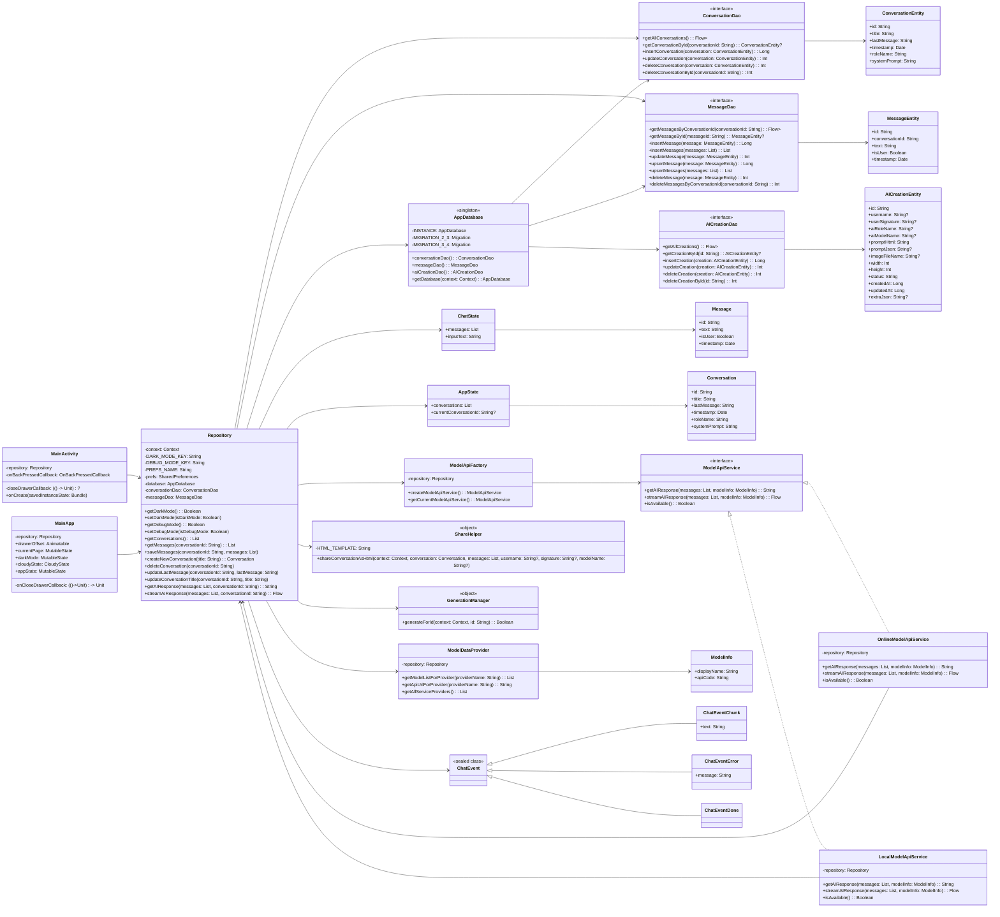

#### UI组件类图

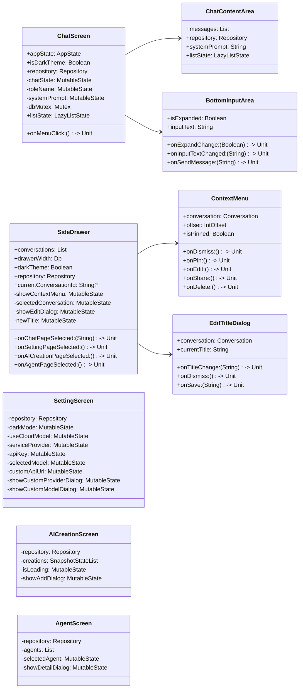

#### 网络与数据流类图

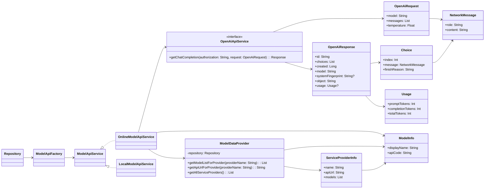

### 包结构图

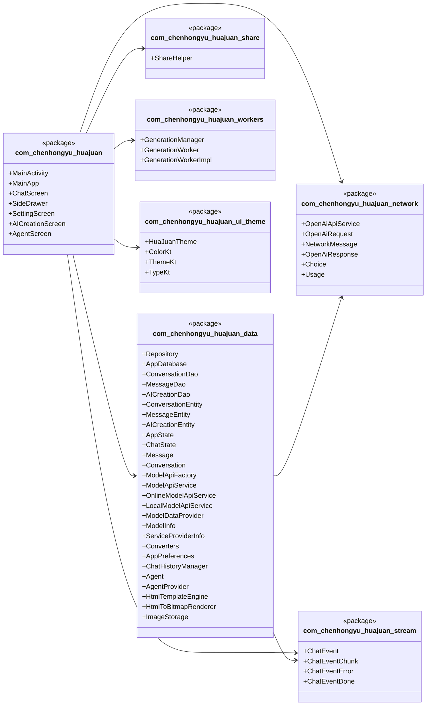

## 主要流程图

### 消息发送与接收流程

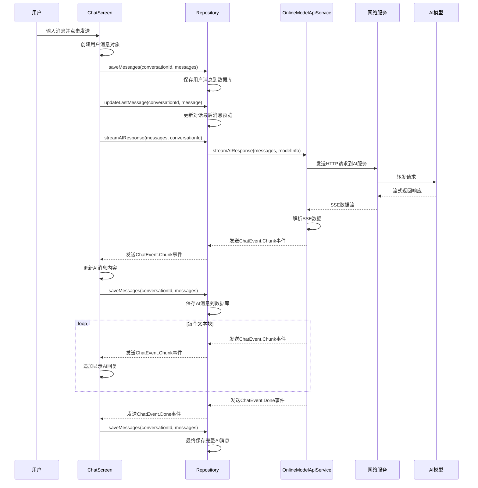

### 对话创建与切换流程

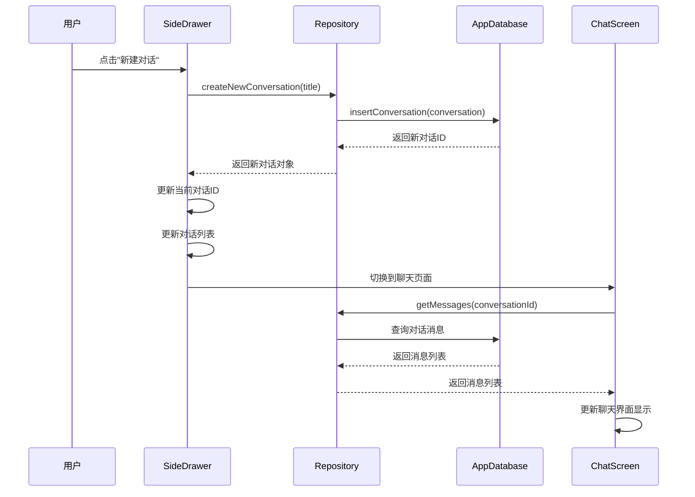

### AI创作生成流程

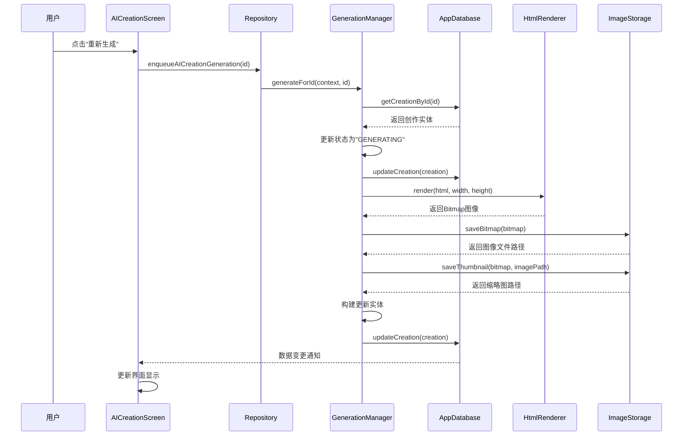

### 应用启动初始化流程

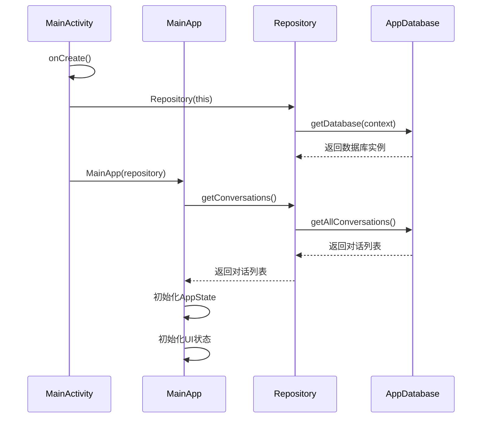

### 消息分享流程

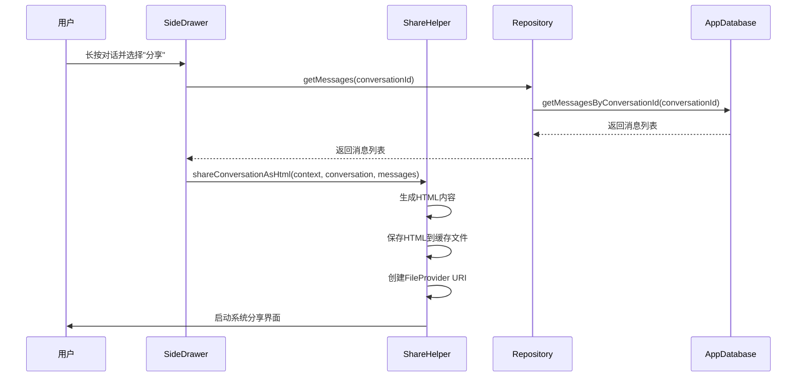

## 工作拆分

### 第一部分：项目初始化与基础架构搭建

1. 项目初始化与环境配置
   - 创建基于Kotlin的Android项目，配置Jetpack Compose UI框架
   - 配置Gradle Kotlin DSL构建系统，整合Retrofit+OkHttp网络库
   - 集成Room数据库用于本地数据持久化存储
   - 配置multiplatform-markdown-renderer库实现Markdown格式消息渲染

2. 核心数据模型与架构设计
   - 设计ConversationEntity和MessageEntity数据实体类
   - 实现Repository模式，封装数据访问逻辑
   - 构建AppState和ChatState状态管理模式
   - 建立ModelApiService抽象层，为云模型和本地模型提供统一接口

### 第二部分：信息消息相关实现

1. 聊天界面与交互实现
   - 开发主聊天界面，包含消息展示区域和输入控件
   - 实现消息发送与接收功能，支持用户消息和AI回复的区分显示
   - 集成Markdown渲染组件，支持代码高亮和数学公式显示
   - 实现消息操作功能（点赞、点踩、复制、收藏等）

2. 数据持久化与对话管理
   - 实现Room数据库的对话和消息存储功能
   - 开发对话创建、重命名、删除等管理功能
   - 实现对话历史记录展示与切换
   - 添加对话置顶功能

### 第三部分：模型调用实现

1. 云端模型调用实现
   - 实现OnlineModelApiService，支持多种AI服务商（硅基流动、火山引擎等）
   - 开发ModelDataProvider管理不同服务商的模型列表和API地址
   - 实现流式响应处理，支持SSE协议逐字输出效果
   - 集成API密钥管理和多服务商切换功能

2. 本地模型调用实现
   - 实现LocalModelApiService，为本地模型提供统一接口
   - 集成MNN-LLM框架，打包Qwen3-0.6B等轻量级模型
   - 实现本地模型的加载、推理和响应生成
   - 开发云端/本地模型切换机制

### 第四部分：扩展功能与用户体验优化

1. 角色系统与智能体实现
   - 实现系统提示词管理，支持为每则对话设置独立角色和提示词
   - 开发AgentProvider管理预设角色模板
   - 实现智能体发现页面，支持快速创建角色专属对话

2. 分享与社区功能实现
   - 实现对话HTML格式导出功能，支持美观的样式和元数据显示
   - 开发AI创作分享页面，支持图片和文本内容展示
   - 实现AI创作发布功能，支持模板化展示
   - 集成FileProvider实现安全的文件分享机制

3. UI优化与交互完善
   - 实现侧边栏拖拽手势交互，优化视觉效果
   - 完善页面切换动画和日夜主题适配
   - 实现响应式布局，适配不同屏幕尺寸
   - 优化消息自动滚动和手动滚动的交互逻辑

## 排期

### 第一阶段：基础框架搭建（2025-12-03）

1. 项目初始化与基础框架搭建：创建基于Kotlin的Android项目，配置Jetpack Compose UI框架，配置Gradle Kotlin DSL构建系统
2. 聊天功能初步实现：实现基础的聊天UI，包括消息显示区域和输入控件，支持用户消息和AI回复的区分显示
3. Markdown渲染支持：集成multiplatform-markdown-renderer库，支持代码高亮和数学公式显示
4. 数据库初始化：配置Room数据库，创建ConversationEntity和MessageEntity表结构

### 第二阶段：UI优化与动画效果（2025-12-04 上午）

1. UI页面美化：使用Material Design 3设计风格，优化颜色搭配和布局间距，改善视觉效果
2. 页面切换动画效果实现：实现页面切换时的类豆包动画效果，使用Compose动画API实现流畅过渡
3. 日夜主题：实现明暗变换效果，支持系统主题跟随和手动切换
4. 控制逻辑完善：完善主页面与侧边栏的交互逻辑，包括手势识别和状态管理
5. 侧边栏UI优化：优化侧边栏UI，实现拖拽手势交互，优化视觉效果

### 第三阶段：主体功能实现基础（2025-12-04 下午）

1. 文件结构调整：对项目文件结构进行合理拆分与重整，按照功能模块划分结构
2. 核心功能实现：实现对话核心功能逻辑，引入Repository模式和ModelApiService抽象层，以备接入云端/本地模型不同的调用逻辑
3. 侧边栏修正：修复侧边栏相关问题，包括对话列表显示异常和点击响应问题
4. 对话相关类的实现：初写ConversationEntity和MessageEntity数据实体类，实现新建对话功能
5. UUID支持：引入UUID库用于生成唯一标识符，为对话和消息提供全局唯一ID
6. 对话相关类完善：完善对话正常切换功能，确保状态正确传递和界面及时更新
7. 移除动态效果：移除对话切换时的动态效果，简化交互逻辑
8. 移除流式相关代码：暂时移除所有流式输出相关代码，待后续一并实现，保持代码整洁

### 第四阶段：云端模型调用实现（2025-12-05）

1. 模型名称更改：更新模型名称，统一使用各服务商官方模型标识符
2. 默认模型调整与调用格式适配：更新不同服务商的适配问题，确保请求格式符合各API要求
3. 模型服务商切换功能：完成模型服务商切换功能，支持硅基流动、火山引擎等多种服务商
4. 历史对话功能：完善历史对话部分功能，实现对话持久化存储和加载
5. API密钥管理：实现API密钥的安全存储和管理机制

### 第五阶段：本地模型与MNN-LLM集成（2025-12-06~08）

1. 引入MNN-LLM框架，配置CMakeLists.txt编译脚本：集成MNN推理框架，配置NDK编译选项
2. 链接核心库：设置不同架构的切换，支持armeabi-v7a、arm64-v8a等主流架构
3. 仿效示例代码实现桥阶层：参考MNN-LLM示例实现Java与CPP之间的JNI桥接层
4. 实现JAVA与CPP代码的耦合：通过JNI接口实现Java层与C++层的数据传递和方法调用
5. 修改模型输出格式以适配统一的调用接口：调整本地模型输出格式，使其与OnlineModelApiService保持一致
6. 本地模型API服务实现：实现LocalModelApiService，为本地模型提供统一接口
7. 本地模型流式输出适配：适配本地模型流式输出

### 第六阶段：完善本地模型功能（2025-12-08）

1. 模型资源打包：将Qwen3-0.6B-MNN等轻量级模型打包到assets目录
2. 本地模型调用链路完善，完善工厂类：完善ModelApiFactory工厂类，支持云端/本地模型无缝切换
3. 小细节优化：优化模型加载性能，完善错误处理机制

### 第七阶段：完善小功能（2025-12-09）

1. 侧边栏选项框UI：改进侧边栏选项框的UI设计，优化选中状态和悬停效果
2. 侧边栏功能完成：完成侧边栏的所有功能实现，包括对话管理、页面跳转等
3. 置顶功能实现：实现对话置顶功能，支持重要对话置顶显示

### 第八阶段：扩展功能（2025-12-10）

1. 角色/智能体实现：实现角色和智能体功能，支持系统提示词管理和预设角色模板
2. 流式输出实现：重新实现流式输出功能，支持SSE协议逐字输出效果
3. 自动滚动版本修复：修复自动滚动版本，优化消息到达时的滚动体验
4. 整段对话分享功能完成：完成整段对话分享相关功能，支持导出为美观的HTML文件
5. AI对话分享页面界面实现：实现AI对话分享页面的界面，支持瀑布流布局展示创作内容
