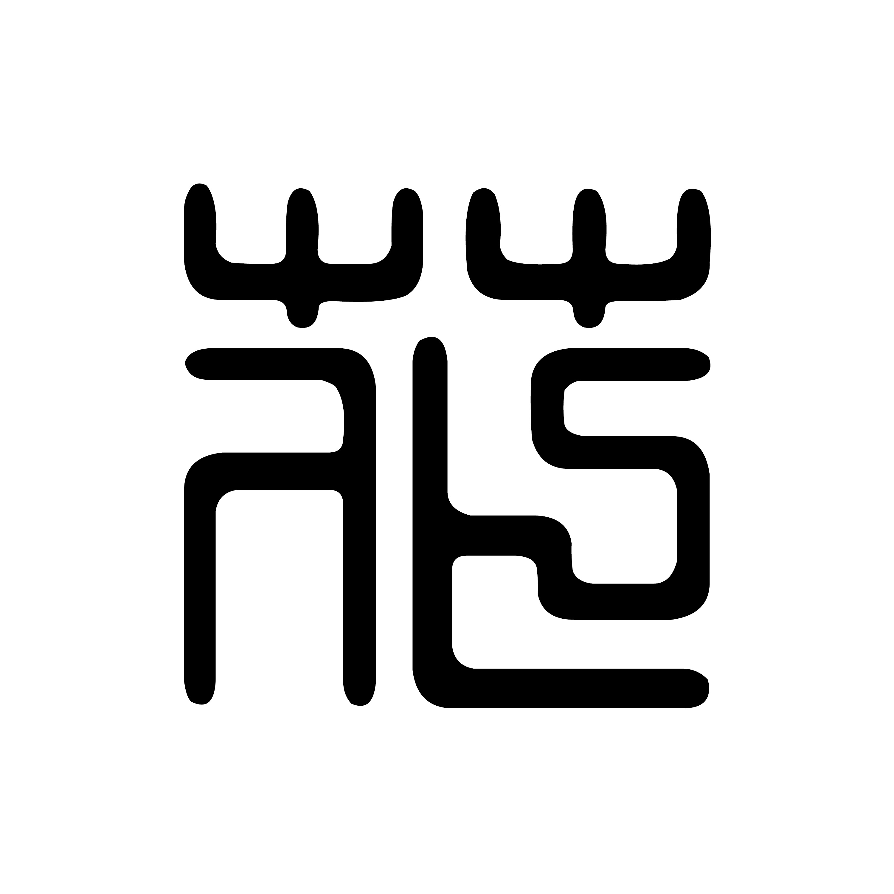
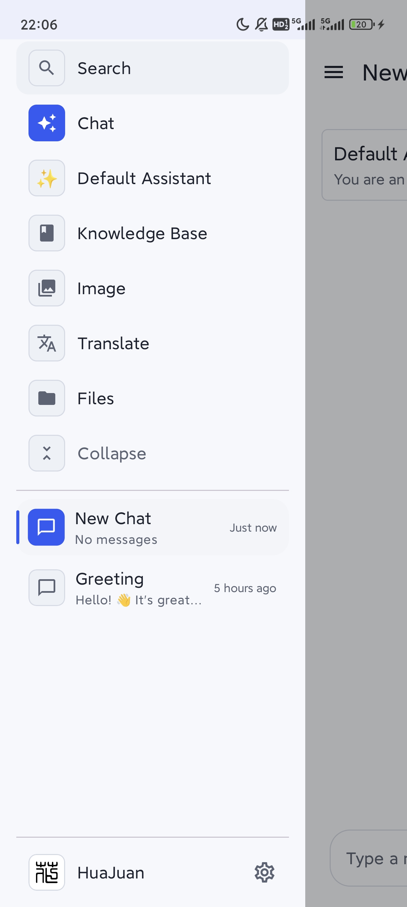
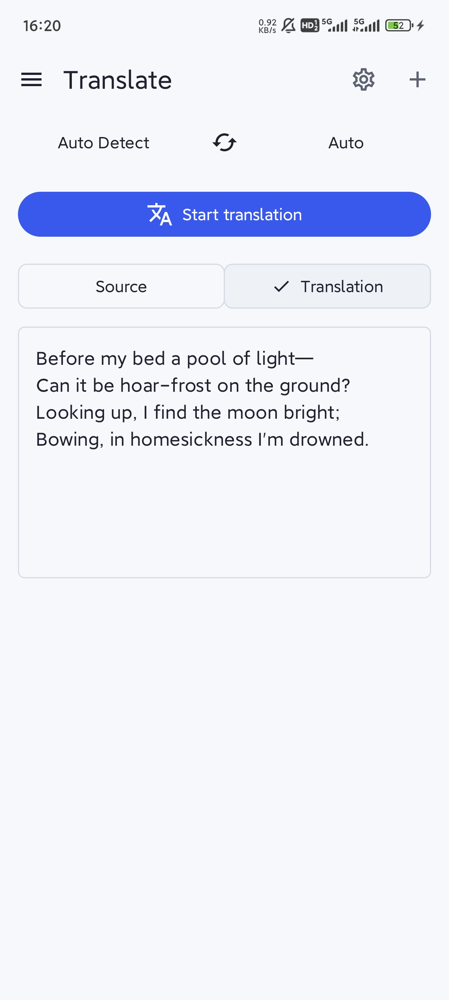
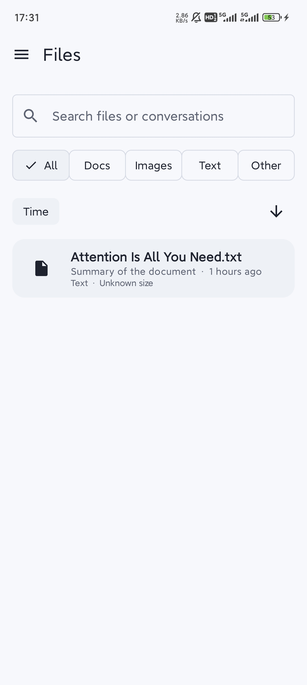

<h1 align="center">
  <a href="https://github.com/Enchograph/HuaJuan/releases">
    <br>
  </a>
</h1>
<p align="center">
  <a href="../../README.md">English</a> | 中文<br>
</p>

<div align="center">

[![][deepwiki-shield]][deepwiki-link]
[![][github-release-shield]][github-release-link]
[![][github-contributors-shield]][github-contributors-link]
[![][license-shield]][license-link]
[![][sponsor-shield]][sponsor-link]

</div>

<div align="center">

# 花卷

一款面向 Android 的开源 AI 客户端，将本地模型、云端模型、知识工作流与创作能力整合进统一且精致的移动端体验。

**开箱可用、可深度自定义，适合日常 AI 对话、知识管理与创作场景。**

❤️ 喜欢花卷？点亮小星星！ ✨

</div>

## ✨ 为什么选择花卷

花卷不只是一个聊天界面，而是一套完整的 Android AI 工作台。它将本地推理、云端接入、知识库、图像生成和文件工作流收拢到同一应用中，兼顾体验与扩展性。

### 核心亮点

- **📱 现代移动端体验**：界面清爽，交互动效丰富，并支持自然的明暗主题切换。
- **🧠 本地与云端模型并行**：基于 MNN 实现安卓本地大模型部署与推理，内置 Qwen3-0.6B 可直接试用，同时支持 OpenAI、Gemini、Anthropic、硅基流动等云端模型。
- **📚 知识工作流完整**：可使用自选 embedding 模型索引文件、笔记和网页，构建自己的知识库体系。
- **🎨 创作与生产能力集中**：支持生图、文件管理、翻译、话题整理与高自定义助手，覆盖更完整的 AI 使用场景。

## 🖼️ 界面预览

<p align="center">
  
  
  
</p>
<p align="center">
  
  
  
</p>

## 🌟 功能特性

### 📱 体验设计

- **现代化交互页面**：采用现代化扁平设计与丰富动效，整体观感更轻盈自然。
- **美观的主题切换**：支持明暗主题切换，兼顾视觉统一与日常使用体验。
- **开箱即用**：内置可立即体验的本地模型能力，降低初次上手门槛。

### 🧠 模型与智能能力

- **安卓本地模型部署**：基于 MNN 实现安卓平台上的本地大模型部署与调用。
- **丰富的云端模型支持**：支持 OpenAI、Gemini、Anthropic、硅基流动等多种云端模型接入。
- **智能助手与对话**：提供高自由度的助手生态，允许用户进行高度自定义。

### 📚 知识与创作能力

- **知识库体系**：支持使用自选 embedding 模型索引多种格式的文件、笔记与网页。
- **专业生图页面**：提供参数详尽可调的移动端生图工作流页面。
- **AI 驱动翻译**：将翻译能力纳入统一的 AI 工作流中。

### 🗂️ 工作流与组织管理

- **全面文件管理**：支持全应用文件的检索、管理与批量操作。
- **全局搜索**：帮助用户快速定位内容与资源。
- **话题管理系统**：便于整理会话与材料，保持信息结构清晰。

## 🛣️ 开发计划

当前进行中与后续规划中的事项包括：

- 交互逻辑的改进
- 性能提升
- **MCP 功能的后端接入**
- OCR 光学字符识别，拟基于 Deepseek OCR
- TTS 语音交互，拟基于 MNN TTS
- 本地模型市场的开发

## 🤝 参与贡献

欢迎以任何规模的方式参与花卷项目。你可以通过以下方向提供帮助：

- 提出改进建议
- 反馈问题与缺陷
- 进行代码优化
- 开发计划中的功能
- 撰写项目文档
- 推进项目国际化（i18n）
- 宣传与分享花卷项目

### 🚀 快速开始

1. **Fork 仓库** 并克隆到本地。
2. **创建分支** 用于你的改动。
3. **提交并推送** 你的更改。
4. **发起 Pull Request**，清楚说明修改内容与原因。

## 🛠️ 构建与运行

### 📦 安装

#### 1. 克隆项目

```bash
git clone https://github.com/Enchograph/HuaJuan.git
cd HuaJuan
```

#### 2. 使用 Android Studio 打开

- 启动 Android Studio
- 选择 `File` -> `Open`
- 选择项目根目录
- 等待 Gradle 同步完成

#### 3. 配置 NDK 和 CMake

如果 IDE 没有自动配置，可在 `local.properties` 中设置：

```properties
ndk.dir=/path/to/ndk
cmake.dir=/path/to/cmake
```

### ⚙️ 本地构建

#### Windows

```powershell
.\gradlew.bat :app:assembleDebug --no-daemon
```

#### macOS/Linux

```bash
./gradlew :app:assembleDebug --no-daemon
```

## 🙏 参考与致谢

- [MNN](https://github.com/alibaba/MNN)：为花卷的安卓本地模型部署能力提供了关键基础。
- [MnnLlmChat](https://github.com/longluo/MnnLlmChat)：在安卓本地模型部署实现中提供了参考。

感谢开源社区的持续贡献，使花卷这样的项目成为可能。

## 👥 贡献者

<a href="https://github.com/Enchograph/HuaJuan/graphs/contributors">
  
</a>

<br /><br />

<!-- Links & Images -->

[deepwiki-shield]: https://img.shields.io/badge/Deepwiki-HuaJuan-0088CC
[deepwiki-link]: https://deepwiki.com/Enchograph/HuaJuan

[github-release-shield]: https://img.shields.io/github/v/release/Enchograph/HuaJuan
[github-release-link]: https://github.com/Enchograph/HuaJuan/releases
[github-contributors-shield]: https://img.shields.io/github/contributors/Enchograph/HuaJuan
[github-contributors-link]: https://github.com/Enchograph/HuaJuan/graphs/contributors

[license-shield]: https://img.shields.io/badge/License-MIT-yellow.svg?logo=opensourceinitiative
[license-link]: ../../LICENSE
[sponsor-shield]: https://img.shields.io/badge/赞助支持 -FF6699.svg?logo=githubsponsors&logoColor=white
[sponsor-link]: ../../docs/assets/images/sponsor.png
